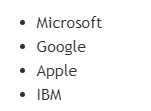
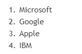
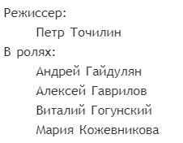
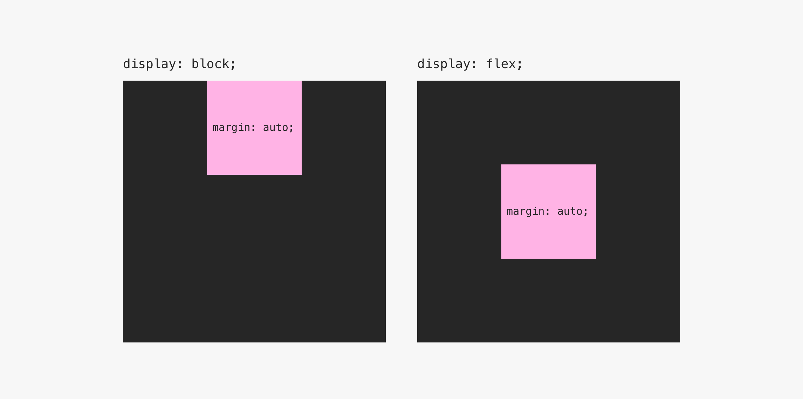

# CSS and HTML workbook
This repository was created to reflect the main points of the theory of web development self-study.
> HTML and CSS are not programming languages! HTML - Hypertext Markup Language (язык гипертекстовой разметки). CSS - Cascading Style Sheets (каскадные таблицы стилей).
## 🎀 Table of contents
- [Introduction to HTML](#introduction-to-html)
- [Lists and tables in HTML](#lists-and-tables-in-html)
- [HTML tags, classes, ids](#html-tags-classes-ids)
- [Flow and block model](#flow-and-block-model)
- [Padding and margin shortcut](#padding-and-margin-shortcut)
- [Borders](#borders)
- [Shadows](#shadows)
- [Introduction to JS](#introduction-to-js)
- [Useful links](#useful-links)

## Introduction to HTML
In VS code you should start with creating <code>index.html</code> file and then in this file write <code>!</code> and press <code>Tab</code> button to get the next piece of code:
```bash
<!DOCTYPE html>
<html lang="en">
<head>
    <meta charset="UTF-8">
    <meta name="viewport" content="width=device-width, initial-scale=1.0">
    <title>Document</title>
</head>
<body>
   lorem50
</body>
</html>
```
#### Lorem Ipsum
Lorem Ipsum is fish text often used in print and web design. Lorem Ipsum has been the standard "fish" for Latin texts since the early 16th century. It has long been found that when evaluating design and composition, readable text makes it difficult to concentrate.

Lorem Ipsum is used because it provides more or less standard template padding, as well as actual distribution of letters and spaces in paragraphs, which is not obtained by simply duplicating "Here is your text.. Here is your text.. Here is your text.."

Number in <code>lorem</code> function shows the required amount of generated Latin text.
#### Word wrap via ALT+Z
For the convenience of presenting long lines of text on the screen, you need to use the keyboard shortcut <code>ALT+Z</code>.
#### Live server extension
After installing <code>Live Server</code> extension press the button <code>go live</code> from the status bar to turn the server on/off. A Quick Development Live Server gives an opportunity for live browser reload. One may start or stop server by a single click from status bar.
#### Comments in the code section
An HTML comment begins with <code>\<! ––</code> and the comment closes with <code>––\></code> . HTML comments are visible to anyone that views the page source code, but are not rendered when the HTML document is rendered by a browser. 

You can also quickly comment or uncomment a line of code with the keyboard shortcut <code>Ctrl + /</code>.

## Lists and tables in HTML
### Lists
HTML lists are used to group related pieces of information. There are three types of lists:

1. unordered  list <code>\<ul\></code> (неупорядоченный, маркированный список): each element of the list (list item) <code>\<li\></code> is marked with a label, such as a filled circle;
```bash
<ul>
  <li>Microsoft</li>
  <li>Google</li>
  <li>Apple</li>
  <li>IBM</li>
</ul>
```
You may use shortcut <code>ALT+SHIFT+↓</code> for adding new list items.
Note, that this shortcut is useful in all situations of duplicating lines of code!

  
2. ordered list <code>\<ol\></code> (упорядоченный, нумерованный список): each element of the list <code>\<li\></code> is marked with a number;
```bash
<ol>
  <li>Microsoft</li>
  <li>Google</li>
  <li>Apple</li>
  <li>IBM</li>
</ol>
```
  
3. the list of definitions <code>\<dl\></code> consists of pairs of term <code>\<dt\></code>  - <code>\<dd\></code>  definition.
Each list is a container containing list elements or term-definition pairs.

List elements behave like block elements, stacked one below the other and taking up the full width of the container block. Each list item has an additional box on the side that is not part of the layout.
```bash
<dl>
  <dt>Режиссер:</dt>
    <dd>Петр Точилин</dd>
  <dt>В ролях:</dt>
    <dd>Андрей Гайдулян</dd>
    <dd>Алексей Гаврилов</dd>
    <dd>Виталий Гогунский</dd>
    <dd>Мария Кожевникова</dd>
</dl>
```
  

### Tables
HTML tables allow web developers to arrange data into rows and columns. You should use tags <code>\<table\></code> and <code>\</table\></code> to create a new table. 
#### Table cells
Each table cell is defined by a <code>\<td></code> and a <code>\</td></code> tag. Everything between <code>\<td></code> and <code>\</td></code> are the content of the table cell.
#### Table rows
Each table row starts with a <code>\<tr></code> and ends with a <code>\</tr></code> tag.
#### Table headers
Sometimes you want your cells to be table header cells. In those cases use the <code>\<th></code> tag instead of the <code>\<td></code> tag:
#### Table name
Tags <code>\<caption\></code> and <code>\</caption\></code>	define a table caption.

Example:
```bash
<table border="1">
    <caption>Table name</caption>
    <tr>
        <th>1 element of the first row, type: header</th>
        <th>2 element of the first row, type: header</th>
        <th>3 element of the first row, type: header</th>
    </tr>
    <tr>
        <td>1 element of the second row</td>
        <td>2 element of the second row</td>
        <td>3 element of the second row</td>
    </tr>
    <tr>
        <td>1 element of the third row</td>
        <td>2 element of the third row</td>
        <td>3 element of the third row</td>
    </tr>
  </table>
```
## HTML tags, classes, ids
Several classes should be written inside the value of one class attribute separated by a space:  

```bash
<div class="first second"></div>
```

For example, general properties can be specified by a rule on the <code>text</code> class, and unique properties can be specified by an individual <code>special-text</code> class.  

```bash
<p class="text">Composition of the day:</p>
```
```bash
<p class="text special-text">Bonobo, Rhye - Break Apart</p>
```
```bash
.text {
   font-size: 20px;
}
.special-text {
     font-size: 32px;
     color: #FEEB78;
}
```
Through a space, you can specify any number of classes.

## Flow and block model 
Document flow (data flow) in HTML is the order in which elements are displayed on the page. In the usual form, all blocks are displayed in the order in which they are written inside the HTML document.
The browser reads the file code from top to bottom and renders the page in the same way. Therefore, the elements are said to follow each other in a flow.  
Every HTML element has a default display value, depending on what type of element it is.  
There are two display values: **block** and **inline**.

### Block-level Elements
A block-level element always starts on a new line, and the browsers automatically add some space (a margin) before and after the element.  
A block-level element always takes up the full width available (stretches out to the left and right as far as it can).  
For example, the <code>div</code>, <code>section</code>, <code>header</code>, <code>h1</code> - <code>h6</code> and <code>p</code> tags, when flowing, take up the entire width of their parent by default. Such elements are conventionally called *block elements*.  
Example:  
<kbd></kbd>  
Here are the block-level elements in HTML:
  

Note, that the picture is not a block element, it is displayed with its original dimensions and can go beyond the parent block.

### Inline Elements
An inline element does not start on a new line. It only takes up as much width as necessary.  
If they are in a row, then by default they are all on the same line. They cannot be given a width or height - they ignore sizing through styles.
Example (this is a ***\<span\>*** element inside a paragraph):  
<kbd></kbd>  
Here are the inline elements in HTML:
   

### Inline-block Elements
What to do when blocks with certain sizes should follow each other horizontally and not occupy the entire line? You can set the elements of the combined type - block-line.  
On the one hand, they do not take up the entire horizontal, on the other hand, allows to set a width and height on the element via CSS. For example, this is how  elements behave. 
The type is overridden by the display property:  

<code>display:block;</code> - *makes the element of block type*  

<code>display: inline;</code> - *makes the element of inline type*  

<code>display: inline-block;</code> - *makes the element of inline-block type*  

   
Compared to <code>display: inline</code>, the major difference is that <code>display: inline-block</code> allows to set a width and height on the element.  
Also, with <code>display: inline-block</code>, the top and bottom margins/paddings are respected, but with <code>display: inline</code> they are not.  
Compared to <code>display: block</code>, the major difference is that <code>display: inline-block</code> does not add a line-break after the element, so the element can sit next to other elements.

So, the cards fit in a line, but not close, although the indents between them were not set. You can remove the unexpected gap by assigning some class to the parent element and setting its <code>font-size: 0</code> property in the file.

### Centering elements: margin: auto
The special value <code>auto</code> works with the centering of block elements. It automatically sets the maximum possible horizontal offset. Setting the <code>margin-left</code> and <code>margin-right</code> properties to <code>auto</code> will get the maximum padding on both sides, and the element will be centered on its parent.  
   

**An example using a shortcut**  
Let's put the element in the center of the screen, giving its left anf right margins a value of <code>auto</code>. Let's do this with just one property, the margins above and below can be set to 0:  
```bash
margin: 0 auto;
```

### Centering elements: display: flex
Let's look at a way to automatically center an element. For the <code>display</code> property, in addition to <code>block</code>, <code>inline</code>, and <code>inline-block</code>, there is a special <code>flex</code> value:
```bash
display:flex;
```
   
An element with this property becomes a flex container. For example, inside it <code>margin: auto</code> works not only horizontally.
## Padding and margin shortcut

<b>Margin</b> is the space around the element's border outside.  
Unlike outer margins, <b>padding</b> is located inside the element and creates free space between the border and the content. The word "padding" is taken from tailors and means a shoulder pad - a pad between the fabric of the jacket and the shoulder.

The model of any element looks like this:

-content with dimensions width (ширина) and height (высота);

-margins (внешние отступы, поля);

-padding (внутренние отступы);

-borders (границы).


When they say “element 200 by 300”, they mean the size of the content up to and including the border, margin is not included here.


Placement direction - ***clockwise***, starting from the top.  
*with 4 values*: each side has its own value  
```bash
padding: 20px 15px 30px 15px;
```
*with 3 values*: top - 10px, sides - 20px, bottom - 30px  
```bash
padding: 10px 20px 30px;
```
*with 2 values*: top and bottom - 10px, sides - 20px  
```bash
padding: 10px 20px;
```
*with 1 value*: 10px on all sides  
```bash
padding: 10px;
```
This approach works for both margin and padding.

## Borders
Element borders are located between margin and padding. In styles, borders are defined by the properties of the border group:  
<code>border-color: #000;</code> - *цвет границы*  
<code>border-width: 1px;</code> - *толщина границы в px*  
<code>border-style: solid</code> - *начертание границы (see picture)*  

Instead of writing the three properties separately, developers use the short form. The color, width and style values are indicated inside one short property (shortcut) separated by a space:  

<code>border: 3px solid #000;</code> - *3px solid black border (непрерывная граница черного цвета толщиной 3px)*  

The box-sizing property determines the behavior of borders and padding. By default, the <code>box-sizing: content-box</code> rule applies to all elements, borders, and padding expand the element.  
By setting <code>box-sizing: border-box</code>, you change the way the element's dimensions are calculated: borders and padding are drawn inward. The total width will be equal to the <code>width</code> value. Pretty intuitive behavior, so normal practice is to set it for all elements on the page at once.


In order not to type <code>box-sizing</code> manually for all elements, you should use the universal selector <code>\*</code>. It passes properties directly to every element on the page. Since <code>\*</code> is a very general selector, it must be specified at the very beginning of the CSS file.
## Shadows
Shadow is a useful design tool. The <code>box-shadow</code> property is responsible for its creation.
The property tells the browser on which side of the element the shadow should be drawn, whether to make it larger or smaller, and in what color. In code it looks like this:
```bash
div {
     box-shadow: -2px 2px 5px #FD6969;
  }
```
It means that shadow is shifted 2px to the left, 2px down, blur radius is equal to 5px, shadow color is reddish (#FD6969).  

A sequence of values that describe the shadow:
1. ***horizontal shift*** (a negative value places the shadow to the left of the element, a positive value to the right);  
2. ***vertical shift*** (a negative value places the shadow above the element, a positive value below it);  
3. ***blur radius*** (the larger the value, the wider and paler the shadow);  
4. ***color*** (specified in the same way as the color of the text or background).
   
Sometimes the shadow doesn't need to be moved, just blurring is enough. In this case, the first two values are 0.

A shadow can be created not only for the borders of an element, but also for text. In this case, the <code>text-shadow</code> property is used. It works in a similar way.

## Introduction to JS
#### ✔️ alert
Using the <code>alert()</code> directive, you can display a modal window with some text on the user's screen.
```bash
alert("Message")
```
Due to the fact that the window is modal, work with the browser interface and pages will be blocked. This is inconvenient. A modal window for the user is a window that blocks his work with the browser until he closes this window.

This is the fastest and easiest way to say something to the user, but such a window cannot be styled in any way, which means it is better to use it only for interface prototyping. In the final version of the web page, it is not desirable to use such modal dialogs.
#### ✔️ console.log
Perhaps one of the most used commands in JavaScript is <code>console.log</code>:
```bash
console.log('Useful information');
```
Using the <code>console.log</code> command, you can print information to the browser console. Only developers will be able to see this information, it will be hidden from ordinary users.
#### ✔️ let
The <code>let</code> directive declares a block-scoped variable with the ability to initialize it with a value.
```bash
let pages;
pages = 358; 
```
```bash
let pages = 358; 
```
```bash
let pages = 666;
pages = pages + 5;
```
#### ✔️ Math.random()
To generate random numbers, there is the <code>Math.random()</code> command. It returns a random number between 0 and 1, including zero and not including 1. Math.random() generates a number between 0 and 0.99999999999. So Math.random() * 10 generates numbers from 0 to 9.9999999999.
```bash
let randomNumber = Math.random();
console.log(randomNumber);        // for example, 0.9752705074780903 
```
```bash
let randomNumber = Math.random() * 10;
console.log(randomNumber);       // for example, 5.3575687
```
#### ✔️ Math.floor()
The <code>Math.floor</code> command rounds down a number. That is, it rounds the argument to the nearest smaller integer.
```bash
Math.floor( 45.95);              //  45
Math.floor(-45.95);              // -46
```
#### ✔️ length
The <code>length</code> data property of an Array instance represents the number of elements in that array. 
```bash
let array = [1, 2, 3, 4, 5, 6];
console.log(array.length)
```
#### ✔️ function 

```bash
function sayHello() {
    alert('Hi, Alex'); 
}

sayHello();
```
```bash
let names = ['Adam', 'Tirion', 'Mary', 'Margo', 'Pablo', 'Liam'];
function getRandomElement() {
  let randIndex = Math.floor(Math.random() * names.length);
  console.log(randIndex);
  console.log(names[randIndex]);
}
getRandomElement();
```
```bash
let names = ['Adam', 'Tirion', 'Mary', 'Margo', 'Pablo', 'Liam'];
function getRandomElement(arr) {
  let randIndex = Math.floor(Math.random() * arr.length);
  console.log(randIndex);
  console.log(arr[randIndex]);
}
getRandomElement(names);
```
```bash
function sayHello(name) {
    return 'Hi, ' + name;
}

let greeting = sayHello('Ann');

console.log(greeting);      // "Hi, Ann" — output to console
alert(greeting);            // "Hi, Ann" — shown in modal window
```
#### ✔️ document 
To work with page elements, JavaScript has a special box called <code>document</code>. This box contains all the information about the web page: URL, style sheets, encoding, hyperlinks, all texts. And yes, through the document you can access the control of any element on the page.

Elements can be controlled through JavaScript - one just need to find them, for example, by the name of the element class.
In addition to boxes, JavaScript has tools that can change everything that is in the boxes - not just document.

For example, the <code>querySelector</code> tool. It works like a function and takes as input the class selector of the element you want to access:
```bash
let markElement = document.querySelector('.mark');
```
So the element with the <code>mark</code> class will get into the <code>markElement</code> variable. JavaScript can now change the element's content, style, and behavior.
```bash
let names = ['Adam', 'Tirion', 'Mary', 'Margo', 'Pablo', 'Liam'];
function getRandomElement(arr) {
  let randIndex = Math.floor(Math.random() * arr.length);
  console.log(randIndex);
  console.log(arr[randIndex]);
}
let name = document.querySelector('.name');
names.textContent = getRandomElement(names);
```
The <code>textContent</code> property allows you to read or set the text content of an element.

#### ✔️ addEventListener
Syntax for adding a handler:
```bash
element.addEventListener(event, handler, [options]);
```
Example:
```bash
let button = document.querySelector('.button');

button.addEventListener('click', function () {
  // some actions after clicking
   phrase.textContent = getRandomElement(names);
}); 
```
#### ✔️ if-else construction
```bash
let phrases = ['do it', 'la-la-la-la-la-la', 'text'];

function getRandomElement(arr) {
  let randIndex = Math.floor(Math.random() * arr.length);
  return arr[randIndex];
}

let phrase = document.querySelector('.phrase');
let advice = document.querySelector('.advice');

button.addEventListener('click', function () {
  let randomElement = getRandomElement(phrases);
  if (randomElement.length > 40){
    advice.style.fontSize = '33px';
  } 
  else { 
    advice.style.fontSize = '42px';
  }
  phrase.textContent = randomElement;
});
```
#### ✔️ Objects
<code>Objects</code> are used to store collections of different values and more complex entities.
An object can be created using curly braces {...} with an optional list of properties. A property is a key:value pair, where the key is a string (also called a "property name") and the value can be anything.
```bash
let user = {     // object
  name: "John",  
  age: 30        
};
alert(user.name);
delete user.age;
```
```bash
let objects = [{text: 'first', image: 'https://1.gif'}, { text: 'second', image: 'https://2.png' }]
```
#### ✔️ smoothly 
Let's connect the library for smoothly changing page elements before connectiong with <code>script.js</code>:
```bash
<script src="https://code.s3.yandex.net/web-code/smoothly.js"></script>
<script src="script.js"></script>
```
```bash
let objects = [{text: 'first', image: 'https://1.gif'}, { text: 'second', image: 'https://2.png' }]

function getRandomElement(arr) {
  let randIndex = Math.floor(Math.random() * arr.length);
  return arr[randIndex];
}
let phrase = document.querySelector('.phrase');
let image = document.querySelector('.image');

button.addEventListener('click', function () {
  let randomElement = getRandomElement(objects);
  smoothly(phrase, 'textContent', randomElement.text);
  smoothly(image, 'src', randomElement.image);
}
```
#### ✔️ for
```bash
for (let i = 0; i <= 2; i = i + 1){
  smoothly(phrase, 'textContent', phrases[i].text);
}
```
## Useful links
| **DESCRIPTION** | **LINK** |
|:---------:|:---------:|
| HTML tags list| [https://www.w3schools.com/tags/default.asp](https://www.w3schools.com/tags/default.asp)| 
| HTML color names| [https://www.w3schools.com/tags/ref_colornames.asp](https://www.w3schools.com/tags/ref_colornames.asp) |
| CSS color names| [https://doka.guide/css/web-colors/#nazvanie-cveta](https://doka.guide/css/web-colors/#nazvanie-cveta) | 
| Web gradients| [https://webgradients.com/](https://webgradients.com/) | 
| Lists in HTML| [https://html5book.ru/html-lists/](https://html5book.ru/html-lists/) | 


[Back to content](#-table-of-contents)
