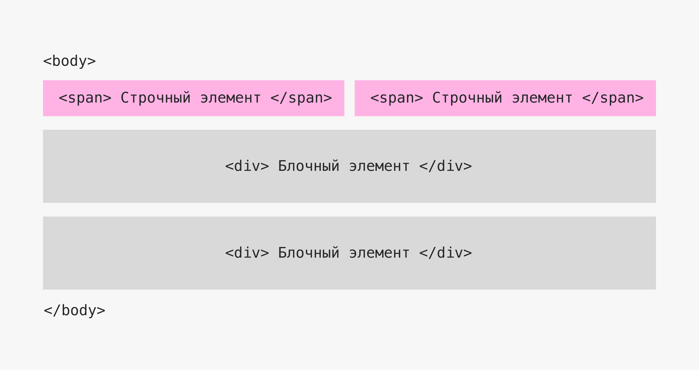
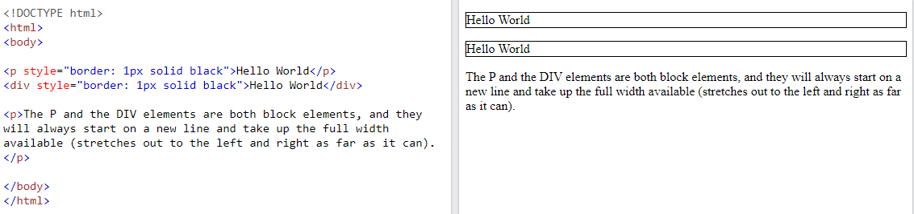
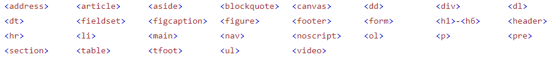
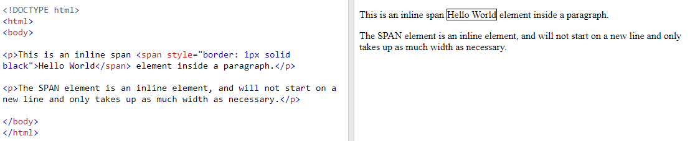
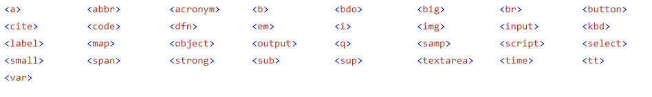
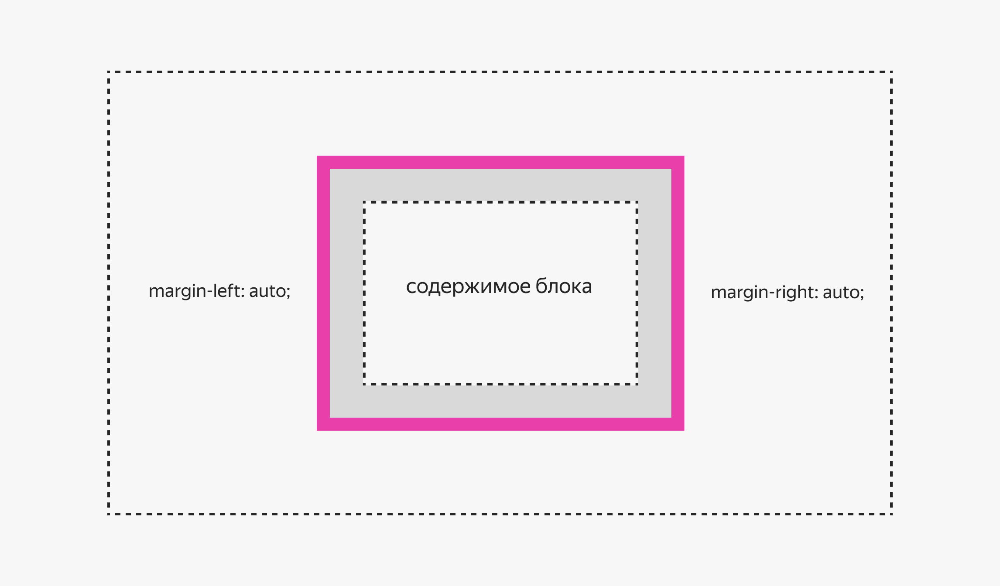
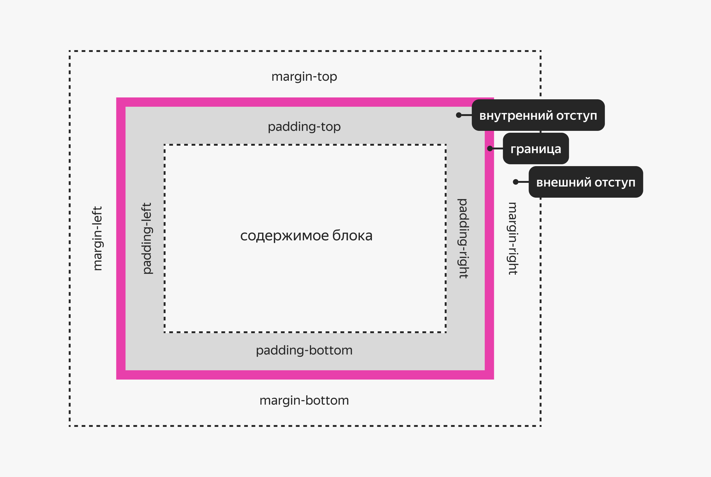
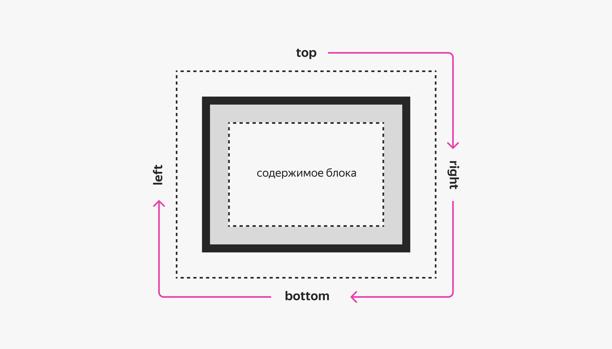
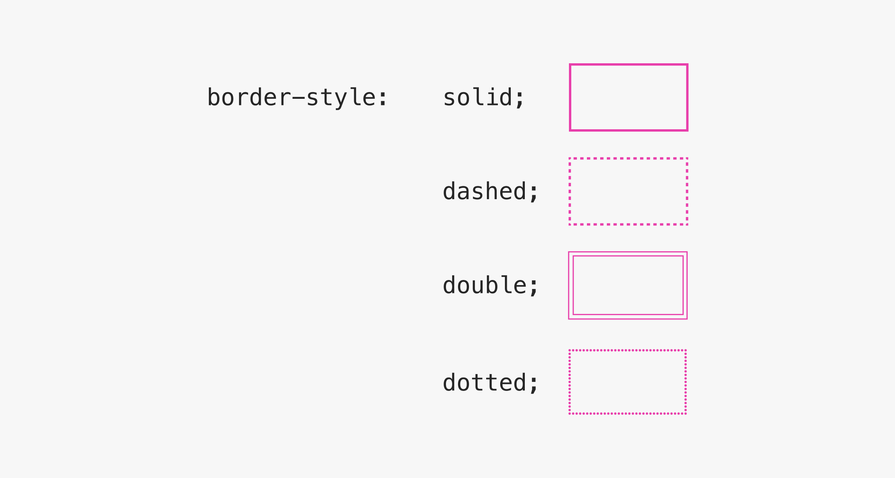
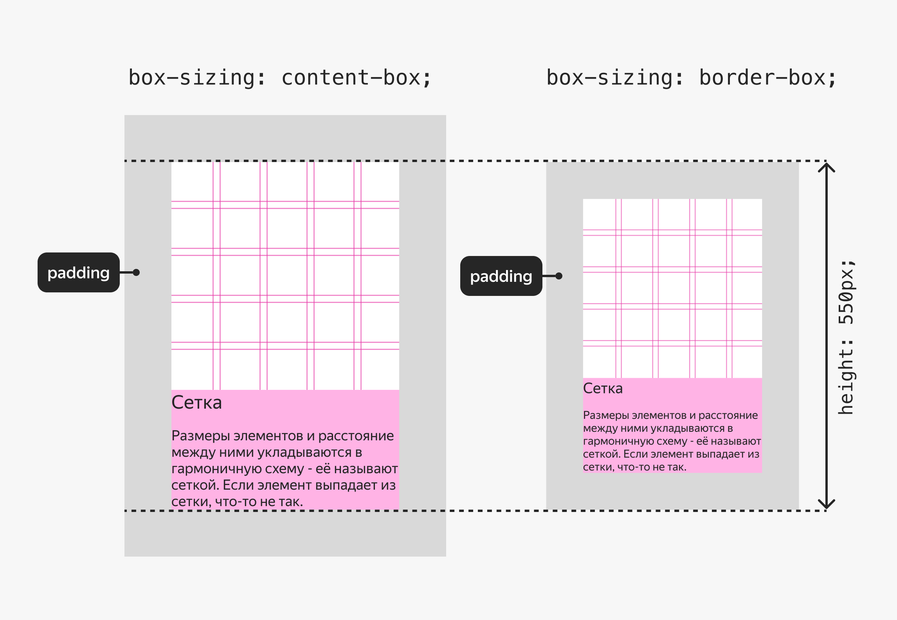

# CSS and HTML workbook
This repository was created to reflect the main points of the theory of web development self-study.
## 🎀 Table of contents
- [CSS rules](#css-rules)
- [Flow and block model](#flow-and-block-model)
- [Padding and margin shortcut](#padding-and-margin-shortcut)
- [Borders](#borders)
- [Useful links](#useful-links)

## CSS rules
Several classes should be written inside the value of one class attribute separated by a space:  

<code>\
\</div\></code>

For example, general properties can be specified by a rule on the <code>text</code> class, and unique properties can be specified by an individual <code>special-text</code> class.  

<code>\
Composition of the day:\</p\></code>

<code>\
Bonobo, Rhye - Break Apart\</p\></code>

.text {
   font-size: 20px;
}

.special-text {
     font-size: 32px;
     color: #FEEB78;
}
Through a space, you can specify two, and three, and four classes. Maybe even five. Or six. Well, you get the idea.

## Flow and block model 
Document flow (data flow) in HTML is the order in which elements are displayed on the page. In the usual form, all blocks are displayed in the order in which they are written inside the HTML document.
The browser reads the file code from top to bottom and renders the page in the same way. Therefore, the elements are said to follow each other in a flow.  
Every HTML element has a default display value, depending on what type of element it is.  
There are two display values: **block** and **inline**.

### Block-level Elements
A block-level element always starts on a new line, and the browsers automatically add some space (a margin) before and after the element.  
A block-level element always takes up the full width available (stretches out to the left and right as far as it can).  
For example, the <code>div</code>, <code>section</code>, <code>header</code>, <code>h1</code> - <code>h6</code> and <code>p</code> tags, when flowing, take up the entire width of their parent by default. Such elements are conventionally called *block elements*.  
Example:  
<kbd></kbd>  
Here are the block-level elements in HTML:
  

Note, that the picture is not a block element, it is displayed with its original dimensions and can go beyond the parent block.

### Inline Elements
An inline element does not start on a new line. It only takes up as much width as necessary.  
If they are in a row, then by default they are all on the same line. They cannot be given a width or height - they ignore sizing through styles.
Example (this is a \<span\> element inside a paragraph):  
<kbd></kbd>  
Here are the inline elements in HTML:
   

### Inline-block Elements
What to do when blocks with certain sizes should follow each other horizontally and not occupy the entire line? You can set the elements of the combined type - block-line.  
On the one hand, they do not take up the entire horizontal, on the other hand, allows to set a width and height on the element via CSS. For example, this is how  elements behave. 
The type is overridden by the display property:  

<code>display:block;</code> - *makes the element of block type*  

<code>display: inline;</code> - *makes the element of inline type*  

<code>display: inline-block;</code> - *makes the element of inline-block type*  

   
Compared to <code>display: inline</code>, the major difference is that <code>display: inline-block</code> allows to set a width and height on the element.  
Also, with <code>display: inline-block</code>, the top and bottom margins/paddings are respected, but with <code>display: inline</code> they are not.  
Compared to <code>display: block</code>, the major difference is that <code>display: inline-block</code> does not add a line-break after the element, so the element can sit next to other elements.

So, the cards fit in a line, but not close, although the indents between them were not set. You can remove the unexpected gap by assigning some class to the parent element and setting its <code>font-size: 0</code> property in the file.

### Centering elements: margin: auto
The special value <code>auto</code> works with the centering of block elements. It automatically sets the maximum possible horizontal offset. Setting the <code>margin-left</code> and <code>margin-right</code> properties to <code>auto</code> will get the maximum padding on both sides, and the element will be centered on its parent.  
   

**An example using a shortcut**  
Let's put the element in the center of the screen, giving its left anf right margins a value of <code>auto</code>. Let's do this with just one property, the margins above and below can be set to 0:  
<code>margin: 0 auto;</code>

## Padding and margin shortcut

<b>Margin</b> is the space around the element's border outside.  
Unlike outer margins, <b>padding</b> is located inside the element and creates free space between the border and the content. The word "padding" is taken from tailors and means a shoulder pad - a pad between the fabric of the jacket and the shoulder.

The model of any element looks like this:

-content with dimensions width (ширина) and height (высота);

-margins (внешние отступы, поля);

-padding (внутренние отступы);

-borders (границы).

When they say “element 200 by 300”, they mean the size of the content up to and including the border, margin is not included here.

Placement direction - ***clockwise***, starting from the top.  
*with 4 values*: each side has its own value  
<code>padding: 20px 15px 30px 15px;</code>  
*with 3 values*: top - 10px, sides - 20px, bottom - 30px  
<code>padding: 10px 20px 30px; </code>  
*with 2 values*: top and bottom - 10px, sides - 20px  
<code>padding: 10px 20px;</code>  
*with 1 value*: 10px on all sides  
<code>padding: 10px; </code>  
This approach works for both margin and padding.

## Borders
Element borders are located between margin and padding. In styles, borders are defined by the properties of the border group:  
<code>border-color: #000;</code> - *цвет границы*  
<code>border-width: 1px;</code> - *толщина границы в px*  
<code>border-style: solid</code> - *начертание границы (see picture)*  

Instead of writing the three properties separately, developers use the short form. The color, width and style values are indicated inside one short property (shortcut) separated by a space:  
<code>border: 3px solid #000;</code> - *3px solid black border (непрерывная граница черного цвета толщиной 3px)*  

The box-sizing property determines the behavior of borders and padding. By default, the <code>box-sizing: content-box</code> rule applies to all elements, borders, and padding expand the element.  
By setting <code>box-sizing: border-box</code>, you change the way the element's dimensions are calculated: borders and padding are drawn inward. The total width will be equal to the <code>width</code> value. Pretty intuitive behavior, so normal practice is to set it for all elements on the page at once.

In order not to type <code>box-sizing</code> manually for all elements, you should use the universal selector <code>\*</code>. It passes properties directly to every element on the page. Since <code>\*</code> is a very general selector, it must be specified at the very beginning of the CSS file.

## Useful links
| **DESCRIPTION** | **LINK** |
|:---------:|:---------:|
| HTML tags list| [https://www.w3schools.com/tags/default.asp](https://www.w3schools.com/tags/default.asp)| 
| HTML color names| [https://www.w3schools.com/tags/ref_colornames.asp](https://www.w3schools.com/tags/ref_colornames.asp) |
| CSS color names| [https://doka.guide/css/web-colors/#nazvanie-cveta](https://doka.guide/css/web-colors/#nazvanie-cveta) | 
| Web gradients| [https://webgradients.com/](https://webgradients.com/) | 

[Back to content](#-table-of-contents)
